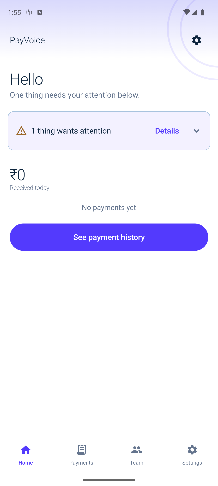
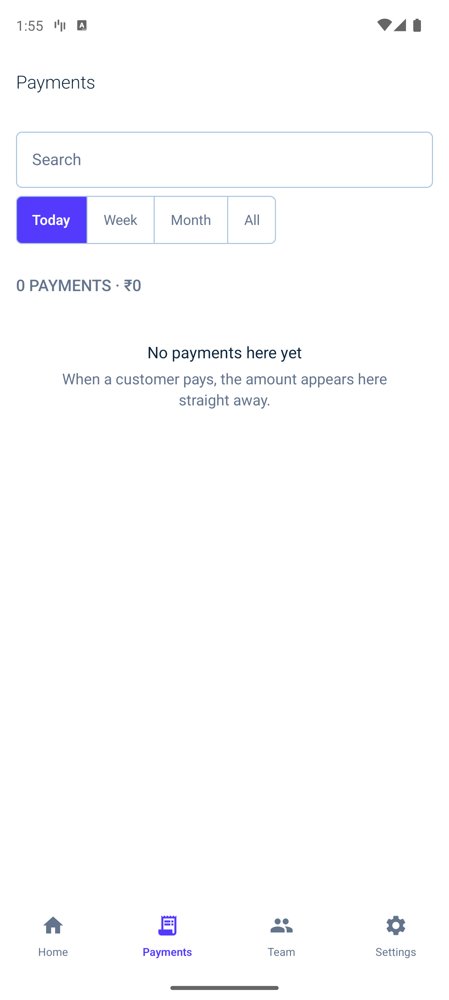
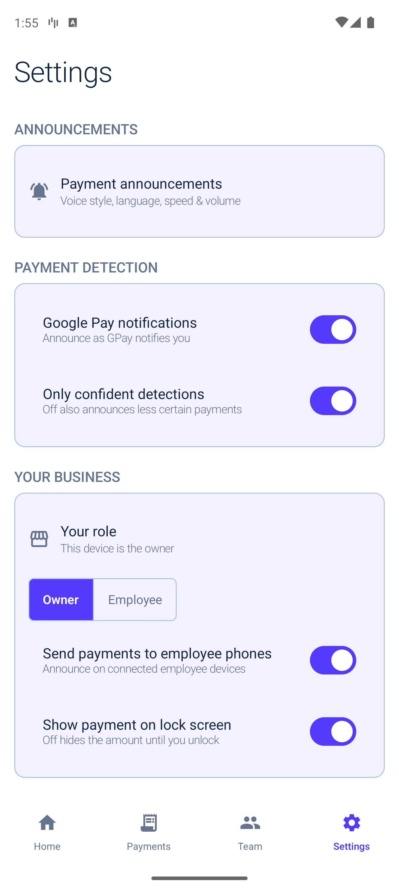
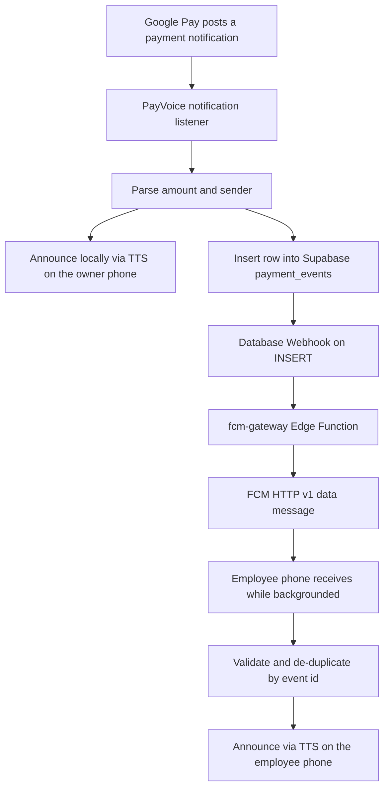

# PayVoice: UPI Payment Announcement App for Shops (Android, Kotlin)

PayVoice is an open-source Android app (Kotlin, Jetpack Compose) that reads Google Pay UPI payment notifications and announces each payment aloud to the shop owner and paired employees.

[](https://github.com/Vivekray898/PayVoice/actions/workflows/ci.yml)
[](LICENSE)
[](https://kotlinlang.org)
[](https://developer.android.com)

> **Status: pre-release.** The current build reports `0.1.0-phase1`. The only
> published artefact is [`v2.9.0`](https://github.com/Vivekray898/PayVoice/releases/tag/v2.9.0),
> a pre-release with an APK attached from 2026-09-30 — **it predates the current
> security audit, backend rework and UI redesign**, so it does not represent
> what is on `main` today. There is no Google Play listing.

---

## Screenshots

<table>
<tr>
<td width="33%"></td>
<td width="33%"></td>
<td width="33%"></td>
</tr>
</table>

Captured from the current `main` build (API 36 emulator, 1344x2992). The Team
tab is not pictured: it renders a live pairing code behind `FLAG_SECURE`, so
Android blocks screenshots of it by design.

---

## What is PayVoice?

A shop owner who takes UPI payments often cannot tell whether a payment
arrived. The phone sits face-down on the counter, the screen is off, or nobody
is looking at it at that exact moment. A hardware soundbox solves this, but
costs money, needs its own charging, and only speaks amounts — it cannot show
you who paid or when. The phone already receives that notification. PayVoice
uses it.

The app registers as an Android **Notification Listener**, reads the payment
notification that Google Pay has already posted, extracts the amount and the
sender, and speaks it aloud through the phone's own text-to-speech engine.
Because that is a bound system service rather than a screen the user has open,
nothing needs to be visible or foreground for a payment to be read and spoken.
Announcements request the **accessibility** audio usage
(`USAGE_ASSISTANCE_ACCESSIBILITY`), so muting media or pausing playback does not
silence a payment alert.

PayVoice also works for a second person in the same shop. The owner generates
a short pairing code; the employee enters it once. From then on the owner's
phone sends each payment event to the employee's phone over **Firebase Cloud
Messaging**, so the employee hears the payment too without the two phones
needing to be near each other. This is the main difference from a hardware
soundbox and from the other open-source UPI announcers: it is a two-phone
system with a shared, permission-scoped backend, not a single-device listener.

It is deliberately narrow. PayVoice reads **Google Pay notifications only** —
it does not read SMS, and it does not read other UPI apps. It never initiates,
authorises, or routes a payment. It announces notifications that have already
arrived.

---

## Key features

- **Announces payments aloud with no extra hardware.** A notification listener
  reads the Google Pay payment notification and the app speaks the amount
  through the on-device TTS engine.
- **Speaks the amount, not just a number.** Three announcement styles:
  `Amount only` ("₹500 received."), `Amount + sender` ("₹500 received from
  Rahul."), and `Full` (spells the amount out with the payment app named).
- **Three announcement voices.** English (`en-IN`), Hindi (`hi-IN`), and
  Hinglish — code-mixed wording spoken by the Hindi voice, for shops where that
  is how people actually talk.
- **Tune it to the room.** Speech speed from 0.8x to 1.5x and a separate volume
  control, plus a **Preview voice** button to hear a setting before saving it.
- **A second phone in the shop hears it too.** Owner and employee pair with a
  one-time code, and the employee's phone receives each payment event over FCM
  data messages while the app is backgrounded or closed.
- **Tells you when a payment would be lost.** A health checklist detects
  revoked notification-listener access, silenced notification channels, Do Not
  Disturb, and battery optimisation — the settings that silently break a
  payment announcer — and links straight to the right system screen to fix
  each one.
- **Remembers the payments.** Local history with search, Today / Week / Month /
  All filters, and configurable retention ("payment memory" and "keep history"
  windows).
- **Your own Supabase backend.** Self-host on Supabase Free. The app ships with
  only a *publishable* Supabase key; every privileged operation happens
  server-side behind Row Level Security.
- **One APK, two roles.** The owner sees their team and payment history; the
  employee sees their pairing status, announcement volume, and the payments
  they are authorised to receive. Role switching changes the bottom navigation
  labels and the screen behind each slot.

---

## How it works



In plain text, for crawlers that do not render Mermaid:

1. Google Pay posts a payment notification to the owner's phone.
2. PayVoice's notification listener reads it and parses the amount and sender.
3. The owner's phone announces the payment aloud immediately, with no network
   involved.
4. In parallel, the app inserts a row into the Supabase `payment_events` table
   with an idempotent `evt_...` identifier.
5. A Supabase Database Webhook calls the `fcm-gateway` Edge Function, which
   looks up active employee devices and sends an **FCM HTTP v1** data message.
6. The employee's phone receives it while backgrounded, validates it,
   de-duplicates it by event id, and announces the same payment.

**Realtime is used for state sync only** — employee and device status. Payment
announcements never ride a websocket, because a backgrounded app cannot hold
one open.

---

## Quick start

### Prerequisites

JDK 11+ (the project targets Java 11), an Android SDK with **compileSdk 37**,
and Android Studio or the Gradle CLI. The Supabase CLI plus Node.js are needed
only for the backend.

### Build and run the app

```bash
git clone https://github.com/Vivekray898/PayVoice.git
cd PayVoice

# Firebase client config only (gitignored, never committed).
# Firebase Console → Project settings → your app → google-services.json
mkdir -p app/src/main/assets
cp /path/to/your/google-services.json app/src/main/assets/google-services.json

# Then put your Supabase URL + publishable key in
#   app/src/main/java/com/vivekray898/payvoice/core/remote/RemoteConfig.kt
# (or override them as string resources). Both constants are placeholders and
# fail fast until replaced, so the app cannot start against the wrong project.

./gradlew :app:installDebug
```

The `google-services.json` Gradle plugin is deliberately **not** applied.
Firebase is initialised manually at process start from that asset file, so no
build-time Firebase credential handling is required.

**Release builds** need a keystore in a gitignored `keystore.properties`.
Without it, `assembleRelease` fails on purpose. For local size or startup
measurement only:

```bash
./gradlew :app:assembleRelease -PallowDebugSignedRelease=true
```

That produces a **debug-signed** artifact for measurement. It must never be
shipped, and CI uses it only to prove the release variant compiles, minifies and
lints.

### Backend

Full step-by-step setup, including the exact console screens and edge-function
secrets, is in **[the backend setup guide](supabase/README.md)**. In short:
create a Supabase project, enable anonymous sign-ins, apply
`supabase/migrations/0001` through `0009` in order, create a Database Webhook on
`payment_events` INSERT pointing at `fcm-gateway`, set the three FCM secrets,
then deploy the function.

```bash
npx supabase functions deploy fcm-gateway --project-ref <project-ref>
```

*These backend steps are reproduced from `supabase/README.md` and were not
re-run against a live project while writing this document.*

---

## Tech stack

| Layer | Technology | Why |
|---|---|---|
| Language | Kotlin 2.2.10, JDK 11 | Android-native, coroutines throughout |
| UI | Jetpack Compose (BOM 2026.02.01), Material 3 | Single design-system source of truth in `ui/components/` |
| Architecture | `lifecycle` ViewModel 2.9.4, Navigation Compose 2.10.2 | Four-tab navigation, role-aware slots |
| Local storage | Room 2.8.5, DataStore 1.2.1 | Payment history with retention; non-secret settings |
| Background work | WorkManager 2.12.0 | Retention pruning, listener repair |
| Async | kotlinx.coroutines 1.11.0 | Blocking HTTP confined to `Dispatchers.IO` under a deadline |
| Serialisation | kotlinx.serialization 1.9.0 | Remote event contract validation |
| HTTP | OkHttp 5.5.0 | Realtime socket plus REST calls |
| Push | Firebase Cloud Messaging 25.1.2 | **Receive only** on the client; sending is server-side |
| Secure storage | `androidx.security` EncryptedSharedPreferences | One Keystore `MasterKey` behind `SecureStore` |
| Startup perf | `androidx.profileinstaller` 1.4.1 | Baseline profile delivery |
| Backend | Supabase: Postgres, Auth, RLS, Realtime, Edge Functions | Free tier, self-hostable |
| Backend runtime | Deno + TypeScript | The `fcm-gateway` Edge Function |

**Firebase is scoped to two things: FCM transport and structural analytics.**
There is no Firestore, no Firebase Auth, no Cloud Functions, no Crashlytics and
no Remote Config in this project — `AGENTS.md` forbids them, and the schema in
`supabase/migrations/` is the whole backend.

**FCM sending uses HTTP v1 only.** The gateway mints a short-lived OAuth 2.0
access token from service-account secrets and calls
`POST https://fcm.googleapis.com/v1/projects/{id}/messages:send`. The legacy
`Authorization: key=...` server-key flow is not used anywhere.

---

## Architecture and security overview

The Android app holds **no privileged credential**. It authenticates as an
anonymous Supabase user and carries only a publishable key; every privileged
operation is enforced server-side by Row Level Security. An owner can only
read and write rows carrying their own `owner_uid`, and an employee can only
read and write their own row.

Verified practices, with the code that enforces each:

- **RLS on every table**, deny by default (`supabase/migrations/0001_init.sql`).
- **`search_path = ''`** on every `SECURITY DEFINER` function
  (`supabase/migrations/0009_definer_search_path.sql`).
- **Publishable key on the client only**; the Edge Function and Database Webhook
  authenticate with a secret key and reject user JWTs.
- **Pairing codes are random, single-use, and expire after 10 minutes**, judged
  against Postgres server time inside an atomic `claim_pairing()` function.
  The client shows distinct reasons for *invalid*, *already-used*, *expired* and
  *auth-not-ready*.
- **Payments are idempotent.** Each event carries an `evt_...` id and is
  de-duplicated on device, so a re-delivered FCM message is never announced
  twice.
- **Secrets at rest** use a single explicitly-aliased Keystore `MasterKey`.
- **Cleartext traffic is disabled**; the TLS floor is `MODERN_TLS`.
- **Backups are disabled** (`allowBackup=false` plus data-extraction rules).
- **CI runs gitleaks over the full git history**, and a release build signed
  with a debug key fails the build on purpose.

Deeper reading:

| Document | Contents |
|---|---|
| [Security threat model](docs/THREAT_MODEL.md) | Assets, trust boundaries, threats |
| [MASVS checklist](docs/MASVS_CHECKLIST.md) | Per-control verdicts, including the ones marked PARTIAL |
| [Security and performance audit](docs/AUDIT_REPORT.md) | Full audit with evidence |
| [Backend setup](supabase/README.md) | Supabase and FCM configuration |
| [Contribution rules](AGENTS.md) | Architecture, security and layout rules for contributors |

A dedicated `SECURITY.md` for reporting vulnerabilities is planned; until it
exists, please open a private security advisory on this repository rather than a
public issue.

---

## Performance on low-end devices

Only measured numbers, with the method stated. Nothing here is estimated.

| Metric | Value | How it was measured |
|---|---|---|
| Release APK | **3.02 MiB** (3,168,913 bytes) | `assembleRelease` output. Minified and resource-shrunk. Built with `-PallowDebugSignedRelease=true`, i.e. debug-signed **for measurement only**. |
| Cold start | **195 ms median** (182–218 ms, 9 runs) | Back-to-back A/B against baseline commit `100e61b` on `emulator-5554` (API 36), **debug builds**, after `force-stop`; first two runs discarded as warm-up. Baseline was 201 ms, so the change is within noise (−3%). |
| Unit tests | **129 passing, 0 failures** | `./gradlew testDebugUnitTest`, counted from the JUnit XML reports. |

Note the honest caveat: the cold-start A/B was run on **debug builds on an
emulator**, not on a release build on physical low-end hardware. Treat it as a
regression signal, not a field performance claim.

---

## Project structure

```text
PayVoice/
├── app/src/main/java/com/vivekray898/payvoice/
│   ├── core/          announce, parser, remote, database, security, health, settings
│   ├── service/       notification listener, FCM receive, TTS, setup, status
│   └── ui/            components (the design system) + one package per screen
├── supabase/
│   ├── migrations/    0001–0009 SQL schema, RLS policies, RPCs
│   └── functions/     fcm-gateway (Deno/TypeScript Edge Function)
└── docs/              audit, threat model, MASVS checklist, design system
```

`ui/components/` is the design system: every screen composes `Pv*` components
only, and three Gradle gates (`verifyDesignTokens`, `verifyDesignComponents`,
`verifyDesignShapes`) fail the build if a screen reaches for a raw Material
widget, hard-codes a colour or size, or draws a pill-shaped control where the
design system reserves that radius for buttons and tag pills.

---

## FAQ

**Is PayVoice free?**
Yes. Apache-2.0 licensed, no paid tier, no in-app purchase, and the backend runs
on Supabase's free tier.

**Does it work without internet?**
On the owner's phone, yes. Capturing a notification and speaking it are both
local, so announcements keep working offline. Only forwarding an event to a
paired employee's phone needs a network connection.

**Which Android versions are supported?**
Android 8.0 (API 26) and newer, built against API 37.

**Which payment notifications does it read?**
Google Pay only (`com.google.android.apps.nbu.paisa.user`). It does not read SMS
and does not read other UPI apps. Adding a source means writing a parser for it.

**How does the employee's phone get the payment?**
Over an FCM data message. The owner's app writes a row to Supabase, a Database
Webhook calls the `fcm-gateway` Edge Function, and it sends the event to that
employee's device. FCM data messages are designed to arrive while the app is
closed or backgrounded. Note that the owner→webhook→FCM→employee leg is the one
part of this chain **not yet verified end to end** against a live project; see
[the reliability results](docs/RELIABILITY_TEST_RESULTS.md).

**Do the two phones need to be near each other?**
No. Pairing associates the devices once in the owner's Supabase account; after
that the employee's phone receives events over the network from anywhere.

**Can an employee see another employee's payments?**
No. Every read is scoped by Row Level Security to the row's own `owner_uid`,
which a client cannot change. Revoking an employee clears their FCM token, so
delivery stops at the database.

**Is PayVoice affiliated with Google, Google Pay, or any UPI provider?**
No. It is an independent open-source project, not affiliated with, endorsed by
or sponsored by any payment provider, and it is not a payment processor.

**How do I self-host the backend?**
It runs on your own Supabase project: apply the nine migrations, create the
Database Webhook, set three FCM secrets, deploy one Edge Function. The full
sequence is in [the backend setup guide](supabase/README.md).

**Does it send my payment data anywhere else?**
Only to the Supabase project you configure and to Firebase Cloud Messaging for
delivery. There is no analytics vendor, advertising SDK or third-party tracking
in the app; see [the analytics event catalogue](docs/ANALYTICS.md) for the only
events it may emit, all structural.

---

## Roadmap

Honest, and ordered by what actually blocks use. Nothing here is built.

- [ ] Cut a release that matches `main`. `v2.9.0` predates the current code,
      and its notes advertise an SMS fallback that the current build removed.
- [ ] Publish the owner/employee pairing flow to end-to-end test against a real
      Supabase project — the reliability run in
      [docs/RELIABILITY_TEST_RESULTS.md](docs/RELIABILITY_TEST_RESULTS.md) is
      still partial on the webhook → FCM → employee leg.
- [ ] Capture screenshots of the current four-tab build.
- [ ] `SECURITY.md`, `CONTRIBUTING.md` and `CODE_OF_CONDUCT.md`.
- [ ] `llms.txt` and `CITATION.cff` for machine-readable citation.
- [ ] Optional parsers for additional UPI apps, behind a per-source opt-in.
- [ ] Screen-level screenshot baselines and Compose previews for every screen.
- [ ] Revisit the health checklist so it audits every channel the app actually
      posts to, not only the payment-events channel.

---

## Contributing, license and support

Contributions are welcome, and the rules for them are unusually explicit because
this project handles someone's actual income.

- **[AGENTS.md](AGENTS.md) is the contributor guide.** It documents the
  architecture, the security invariants that must not be broken, the layout
  rules every screen follows, and the backend key rules. Read it before opening
  a pull request.
- **Good first issues:** the roadmap items above that need no backend access are
  the easiest entry points — the screenshot baselines and screen previews.
  `docs/UI_INVENTORY.md` and `docs/DESIGN_DIRECTION.md` list the remaining
  design work in detail.
- **Open an issue** on this repository for bugs and features.
- **Security problems:** open a private security advisory rather than a public
  issue. A dedicated `SECURITY.md` is planned.

**License:** Apache License 2.0 — see [LICENSE](LICENSE). You may use,
modify and redistribute this software, including commercially, subject to the
license terms and the patent grant.

**Support:** this is volunteer-maintained. Open an issue rather than emailing
anyone.

---

## Disclaimer

PayVoice is an independent open-source project. **It is not affiliated with,
endorsed by, sponsored by, or connected to Google, Google Pay, or any other
payment provider or UPI operator.** "UPI" is used only to name the payment
system whose notifications the app reads.

PayVoice **is not a payment processor, gateway, or financial service.** It does
not initiate, authorise, route, hold, or settle payments, does not touch bank
accounts or card data, and cannot move money. It reads notifications that a
payment app has already posted to the phone and speaks them aloud. Amounts and
sender names come from that notification text, not from a bank or from
PayVoice.

Verify any amount against the payment app itself before relying on an
announcement. Do not use PayVoice as the sole record of a transaction.

---

*Last updated: 2026-10-04 · Verified against commit `cb9c131` · Facts and their
sources: [docs/README_FACTS.md](docs/README_FACTS.md)*
